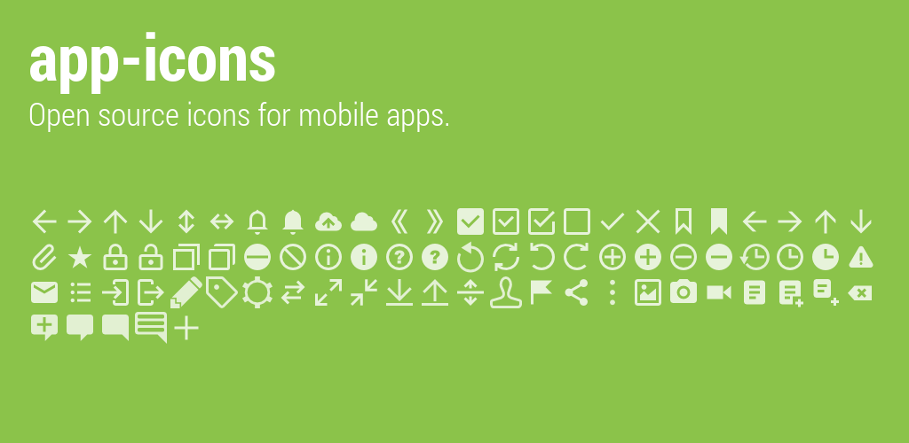

Application icons mainly for Android.

## Contents

* Action bar icons for Android

## Usage

PNG files are in `dist` directory.  
Just copy them to your project!

### Build icons

If you want to build them on your own, then just run:

```sh
./build.sh
```

PNG files will be generated in `dist` directory.

See [CONTRIBUTING](CONTRIBUTING.md) for more details.

## Sample Android app

You can check how they looks like on Android app by this command:

```sh
$ ./gradlew installDebug
```

## TODO

- [ ] map
- [ ] shield
- [ ] trash
- [x] undo
- [x] redo
- [ ] flag
- [x] bookmark
- [ ] cloud
- [ ] bold
- [ ] italic
- [ ] movie
- [ ] telephone
- [ ] friends
- [ ] play
- [ ] pause
- [ ] refresh
- [ ] other settings
- [ ] other edit
- [ ] cut
- [ ] copy
- [ ] paste
- [ ] other arrows
- [ ] other clocks
- [ ] back (arrrrow and x)
- [ ] calendar
- [ ] document
- [ ] new document
- [ ] bookmark with star
- [ ] keyboard
- [ ] other mails
- [x] export
- [x] import
- [ ] share
- [ ] attach
- [x] sort
- [ ] send

## License

Copyright (c) 2014 Soichiro Kashima  
Licensed under MIT license.  
See the bundled [LICENSE](LICENSE) file for details.