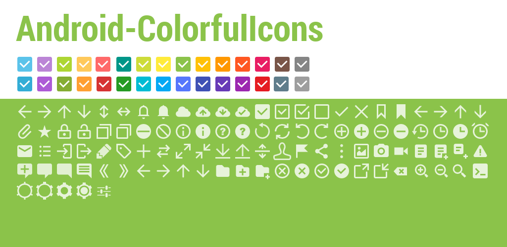

[](https://github.com/ksoichiro/Android-ColorfulIcons/releases/latest)

100+ application icons mainly for Android action buttons.  

## Usage

PNG files are in `dist` directory.  
Just copy them to your project!

### Create icons

As mentioned above, this project contains generated icons for Holo Dark color.  
But if you want other icons, you can create by yourself.

#### Create icon with Holo and Material Design color palettes

If you want more colorful icons, you can create them by executing a script.


For example, if you want icons with Holo blue color, execute this:

```sh
./build.sh -t holo_blue -f src/ic_action_add.svg
```

##### Available colors

You can use the following color names for `-t` option.

1. `holo_light` (#333333)
1. `holo_dark` (#ffffff)
1. `holo_blue` (#33b5e5)
1. `holo_purple` (#aa66cc)
1. `holo_green` (#99cc00)
1. `holo_yellow` (#ffbb33)
1. `holo_red` (#ff4444)
1. `holo_dark_blue` (#0099cc)
1. `holo_dark_purple` (#9933cc)
1. `holo_dark_green` (#669900)
1. `holo_dark_yellow` (#ff8800)
1. `holo_dark_red` (#cc0000)
1. `mtrl_red` (#e51c23)
1. `mtrl_pink` (#e91e63)
1. `mtrl_purple` (#9c27b0)
1. `mtrl_deep_purple` (#673ab7)
1. `mtrl_indigo` (#3f51b5)
1. `mtrl_blue` (#5677fc)
1. `mtrl_light_blue` (#03a9f4)
1. `mtrl_cyan` (#00bcd4)
1. `mtrl_teal` (#009688)
1. `mtrl_green` (#259b24)
1. `mtrl_light_green` (#8bc34a)
1. `mtrl_lime` (#cddc39)
1. `mtrl_yellow` (#ffeb3b)
1. `mtrl_amber` (#ffc107)
1. `mtrl_orange` (#ff9800)
1. `mtrl_deep_orange` (#ff5722)
1. `mtrl_brown` (#795548)
1. `mtrl_grey` (#9e9e9e)
1. `mtrl_blue_grey` (#607d8b)
1. `black` (#000000)
1. `white` (#ffffff)

#### Create all Holo Dark icons

If you want to build all icons with Holo Dark color on your own, then just run:

```sh
./build.sh
```

PNG files will be generated in `dist` directory.

See [CONTRIBUTING](CONTRIBUTING.md) for more details.

## Sample Android app

You can check how they looks like on Android app by this command:

```sh
$ ./gradlew installDebug
```

## TODO

- [ ] map
- [ ] shield
- [ ] trash
- [ ] bold
- [ ] italic
- [ ] telephone
- [ ] friends
- [ ] play
- [ ] pause
- [ ] other edit
- [ ] cut
- [ ] copy
- [ ] paste
- [ ] calendar
- [ ] bookmark with star
- [ ] keyboard
- [ ] other mails
- [ ] send
- [x] undo
- [x] redo
- [x] flag
- [x] bookmark
- [x] cloud
- [x] movie
- [x] refresh
- [x] other settings
- [x] other arrows
- [x] other clocks
- [x] back (arrow and x)
- [x] document
- [x] new document
- [x] export
- [x] import
- [x] share
- [x] attach
- [x] sort

## License

Copyright (c) 2014 Soichiro Kashima  
Licensed under MIT license.  
See the bundled [LICENSE](LICENSE) file for details.